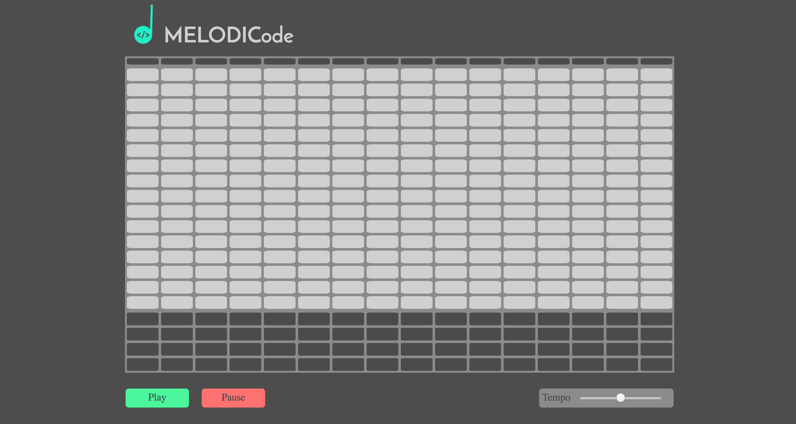

## MELODICode

### Background

[live version here!](http://www.sean-garner.co/MELODICode)

MELODICode is an online browser-based musical step sequencer. It behaves similarly software step sequencers seen in DAWs like FL studio, Ableton Live, etc. Each row of cells in the sequencer belongs to a note in a scale (MELODICode uses the pentatonic scale so most notes sound good together). Users can activate these cells on the sequencer's grid by clicking on them. Once cells are activated and a user hits play, MELODICode loops through the sequencer from left to right triggering and playing any of the notes of the active cells creating a melody.

### Features

With this musical loop sequencer, users are able to:

- [ ] Start, pause the looping time bar.
- [ ] Activate cells to create a melody line of their choosing
- [ ] Increase/ Decrease tempo with a slide bar.
- [ ] In real time be able to change the melody while the sequences is looping
- [ ] Activate cells in the lower grid for drum sample sounds

### Architecture and Technologies

This project implements with the following technologies:

- JavaScript and `jQuery` for overall grid structure and manipulation of elements,
- `Tone.js` for synth sounds that each cell can trigger.

## Future Plans for this Project

### Preset Melodies
  User will be able to toggle buttons that will clear the current grid and then refill with a stock melody. There will be several melodies to choose from, this allows for a more user friendly interaction for those who are unfamiliar with step-sequencers.

### New Synth Sounds
  The main grid will have multiple synth sound options so there is more variety to the melodies users can create.
