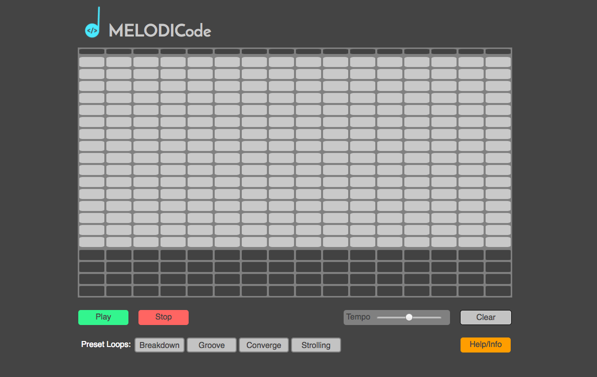

## MELODICode

### Background

[live version here!](http://www.sean-garner.co/MELODICode)

MELODICode is an online browser-based musical step sequencer. It behaves similarly software step sequencers seen in DAWs like FL studio, Ableton Live, etc. Each row of cells in the sequencer belongs to a note in a scale (MELODICode uses the pentatonic scale so most notes sound good together). Users can activate these cells on the sequencer's grid by clicking on them. Once cells are activated and a user hits play, MELODICode loops through the sequencer from left to right triggering and playing any of the notes of the active cells creating a melody!

### Features

With this musical loop sequencer, users are able to:

- [ ] Start, pause the looping time bar.
- [ ] Activate cells to create a melody line of their choosing
- [ ] Increase/ Decrease tempo with a slide bar.
- [ ] In real time be able to change the melody while the sequences is looping
- [ ] Activate cells in the lower grid for drum sample sounds

### Architecture and Technologies

This project implements with the following technologies:

- JavaScript and `jQuery` for overall grid structure and manipulation of elements,
- `Tone.js` for synth sounds that each cell can trigger.

## Future Plans for this Project

### Multiple Sequence loop
  Ideally, there will be a section at the bottom of the grid that acts as queue of sequence patterns. Users will be able to add the current sequence they just created to this queue, then make an entirely new melody pattern and add it to the queue, and so on. When they press "play queue", rather than just looping through the normal 4 bar sequencer it will play this queue's  list of sequences from left to right in a larger loop. So if the user added 4 sequencers to this list, it would play for a total of 16 bars of unique melody before going back to the beginning of the queue. This will allow for more complex melody lines and musical patterns with ability to experiment with entire musical phrases not just a 4 bar loop.

### New Synth Sounds
  The main grid will have multiple synth sound options so there is more variety to the melodies users can create.
